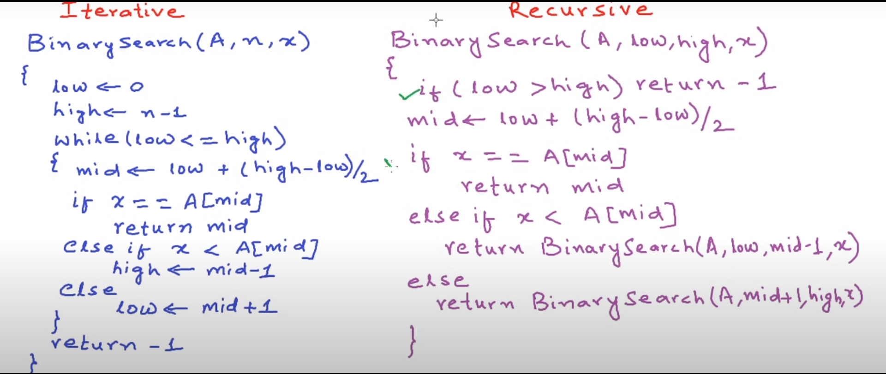

# Binary Search O(logn)

### Pseudo Code 

> Iteration is slightly better in performance because we don't have to store extra states of function (in case of recursion) , but implementation of recursion is easier.

